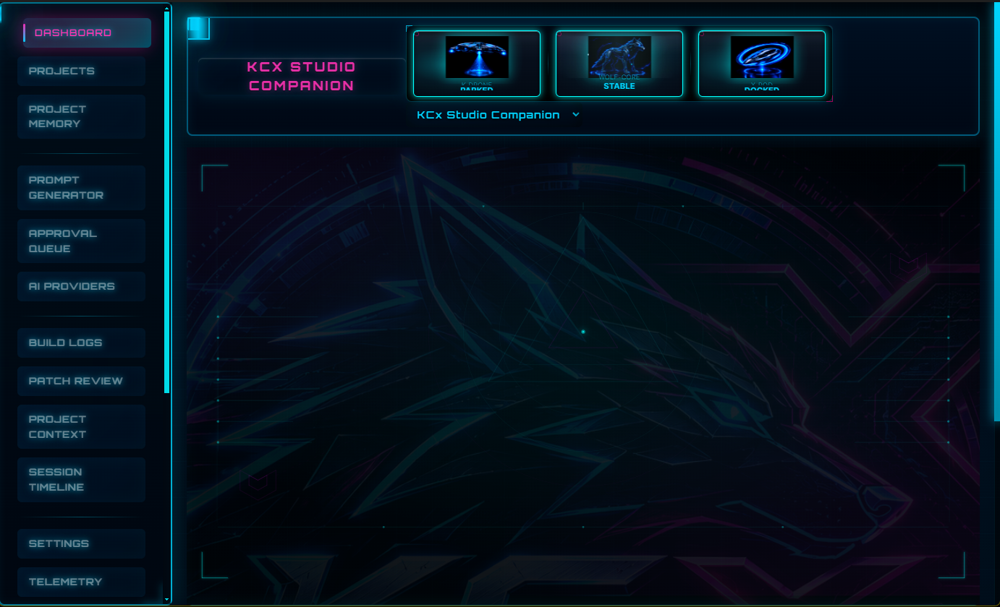
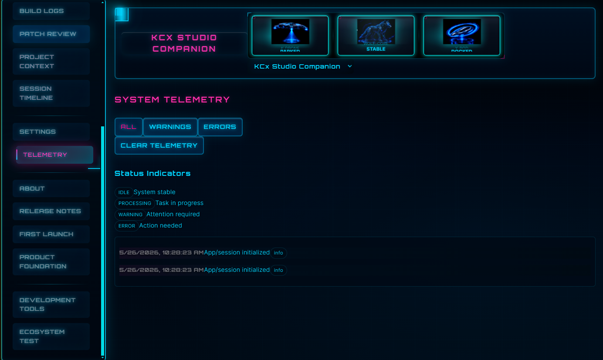

# KCx Studio Companion

AI-assisted desktop development cockpit for orchestration, build analysis, prompt workflows, runtime telemetry, and ecosystem tooling.

---

## Screenshots

### Main Dashboard

### Ecosystem Dock

### Build Logs

### AI Providers

### Runtime Telemetry

### KCx Ecosystem Reference

## Overview

KCx Studio Companion is a local-first desktop environment designed to help manage the real-world AI-assisted software development workflow.

The project focuses on:

- Build analysis
- Prompt orchestration
- Runtime telemetry
- Patch review pipelines
- Workflow stabilization
- AI-assisted iteration systems
- Ecosystem runtime surfaces
- Local-first tooling architecture

The system is designed around a cinematic subsystem-driven UI and a staged orchestration model rather than generic chatbot tooling.

---

## Current Status

**Private Beta — v0.9.0-beta.1**

This release is focused on:

- Workflow validation
- Runtime stabilization
- UI ecosystem architecture
- Prompt chain orchestration
- Build log analysis systems
- Desktop runtime experimentation

---

## Features

### Current Systems

- Electron + React + TypeScript architecture
- Runtime ecosystem dashboard
- Prompt workflow orchestration
- Build analysis pipeline
- Patch review flow
- Local project memory
- Ecosystem telemetry UI
- Workflow history tracking
- Multi-surface subsystem layout
- Local-first runtime philosophy

### Ecosystem Direction

KCx Studio Companion is part of the broader KCx Labs ecosystem:

- KCxMode
- KCx Messenger
- KCx Cortex
- KCx Valhalla
- Robotics systems
- Runtime orchestration layers

---

## Technology Stack

- Electron
- React
- TypeScript
- Vite
- Node.js

---

## Installation

1. Download the latest release ZIP
2. Extract the archive
3. Run the installer or portable executable
4. If Windows SmartScreen appears:
   - Click **More info**
   - Then click **Run anyway**

---

## Release Downloads

Latest beta release:

- https://kcxlabs.org/beta

GitHub releases:

- https://github.com/kcxrhea-bit/KCxStudioCompanion/releases

---

## Notes

- Current builds are unsigned
- Windows SmartScreen warnings may appear
- Features and UI systems are actively evolving
- Some systems are experimental or incomplete

---

## License

This project is distributed under the proprietary KCx Labs license included with releases.

See:

- LICENSE.txt

---

## KCx Labs

Website:

- https://kcxlabs.org

Beta Access:

- https://kcxlabs.org/beta
